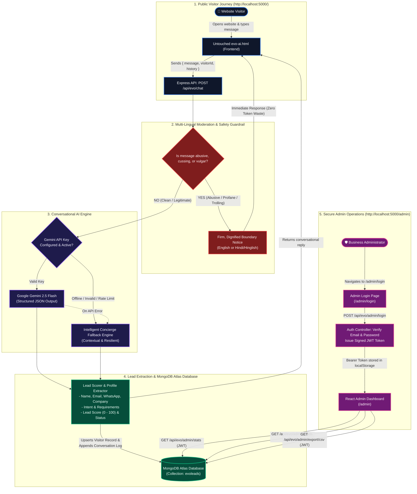

# GrandEvo Evo AI — System Architecture & Flowchart

This document provides a comprehensive overview of how **EVO AI** operates end-to-end, illustrating the dual-plane architecture:
1. **Public Visitor Conversation Plane** (Untouched `evo-ai.html`, Anti-Profanity Guardrail, Gemini LLM + Fallback, Lead Scorer)
2. **Secure Admin Management Plane** (JWT Authentication, Protected API, Real-time Dashboard, Conversation History)

---

## 1. End-to-End System Flowchart

---

## 2. Key Architectural Modules

| Component | Location | Role & Responsibility |
| :--- | :--- | :--- |
| **Public Frontend** | [evo-ai.html](file:///c:/Users/Anmollll/Desktop/evo_testing/evo-ai.html) | Served at `/` exactly as authored. 100% untouched visual design and visitor experience. |
| **Moderation Guardrail** | [moderation.js](file:///c:/Users/Anmollll/Desktop/evo_testing/GrandEvo_Evo_Backend/src/utils/moderation.js) | Intercepts profanity, cuss words, sexual remarks, and slurs (English & Hindi/Hinglish). Rebuffs politely with executive dignity. |
| **Conversational AI** | [aiService.js](file:///c:/Users/Anmollll/Desktop/evo_testing/GrandEvo_Evo_Backend/src/services/aiService.js) | Calls Google Gemini 2.5 Flash using `@google/genai` with strict JSON schema. |
| **Concierge Fallback** | [fallbackEngine.js](file:///c:/Users/Anmollll/Desktop/evo_testing/GrandEvo_Evo_Backend/src/utils/fallbackEngine.js) | Guarantees zero downtime if Gemini credentials or networks fluctuate. |
| **Lead Intelligence** | [leadScorer.js](file:///c:/Users/Anmollll/Desktop/evo_testing/GrandEvo_Evo_Backend/src/utils/leadScorer.js) | Auto-scores visitors 0–100, assigns status (`Hot`, `Warm`, `Exploring`), and detects appointment requests. |
| **MongoDB Atlas** | [Lead.js](file:///c:/Users/Anmollll/Desktop/evo_testing/GrandEvo_Evo_Backend/src/models/Lead.js) | Stores complete contact profiles and full turn-by-turn chat transcripts per visitor. |
| **Admin Portal** | [frontend/src/](file:///c:/Users/Anmollll/Desktop/evo_testing/frontend/src/) | React + Vite + Tailwind CSS admin app with JWT auth, KPI metrics, lead filters, transcript inspector, and CSV export. |
